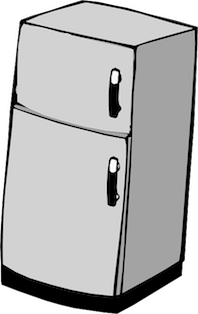

# Una historia especial

Creada por los estudiantes de primer semestre de la LCC y algún que otro profesor, tal como se puede ver en el [listado de colaboradores](colaboradores.md). Con esta historia, pretendemos enterarnos un poco del uso de *git* para trabajo colaborativo así como de la plataforma de *github*.

## El inicio

Al inicio era solo un pequeño bit perdido en un gran procesador. El bitecito estaba solo y tenía monchis, así que se fue a la RAM a ver si había todavía algo que comer en el refri. Tenía tanta hambre, y era tán flojo, que esperaba que quedara algo de lo que cocinó su mamá byte para comérselo frío, en el mismo recipiente donde lo habían guardado, o si era incomible frio (como una gallina pinta) calentarla en el microondas.

Cuando llegó a la RAM y revisó el refri, se encontró que había solo una crema de coliflor y un espagueti que ya tenía una semana. ¿Qué hacer?

1. Si decide calentar la crema en el microondas [selecciona aquí](calentar-micro.md)

2. Si decide comerse el espagueti frio [selecciona aquí](comer-espagueti-podrido.md)

3. Si decide ir a la tarjeta gráfica a jugar LOL [selecciona aquí](jugar-lol.md)

